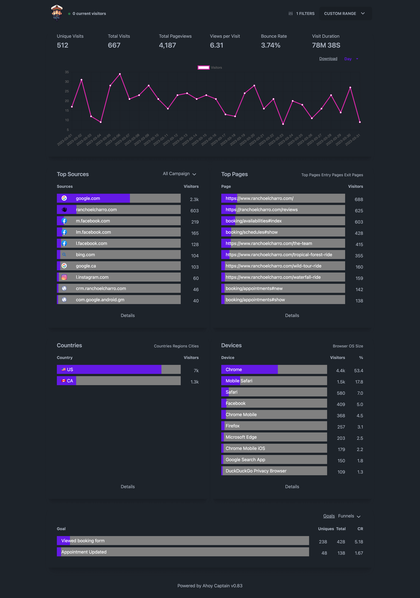

#  AhoyCaptain


A full-featured, mountable analytics dashboard for your Rails app, shamelessly inspired by Plausible Analytics, powered by the Ahoy gem.

<a href="https://github.com/joshmn/ahoy_captain/blob/main/ss.png"></a>
## Notice

Currently requires using PG and a JSONB column for your data.

## Installation

### 1. Do the bundle

Drop it in:

```bash
$ bundle add ahoy_captain
```

### 2. Install it

```bash
$ rails g ahoy_captain:install
```

### 3. Make sure your events are setup correctly

AhoyCaptain doesn't do any tracking for you; it merely provides a dashboard for your data from the Ahoy gem. 

By default, AhoyCaptain assumes you're tracking `controller` and `action` in your `Ahoy::Event` properties, and a page view event is named `$view`. See this section for more information: https://github.com/ankane/ahoy#events

For a quick sanity check:

```ruby
AhoyCaptain.event.where(name: AhoyCaptain.config.event[:view_name]).count
AhoyCaptain.event.with_routes.count
```

This can be fully-customized. See the initializer `config/initializers/ahoy_captain.rb` for more.

### 4. Star this repo

No, seriously, I need all the internet clout I can get.

### 5. Analyze your nightmares

If you have a large dataset (> 1GB) you probably want some indexes. `rails g ahoy_captain:migration`

## Features

* Top sources
* Top pages, landing pages, and exit pages
* UTM reporting
* Top locations, by countries, regions, and cities
* Top devices, by browser, OS, and device type
* Goal tracking
* Funnels
* Filter by:
    * Page
    * Location
    * Device type
    * OS
    * UTM tags
    * Goal
* CSV exports

## Coming soon ™️

* Date comparison

## Contributors

This was built during the Rails Hackathon in July 2023 with [afogel](https://github.com/afogel) and [dnoetz](https://github.com/dnoetz).

## Contributions

Do your worst; please and thank you in advance! :) 

## License

The gem is available as open source under the terms of the [MIT License](https://opensource.org/licenses/MIT).
